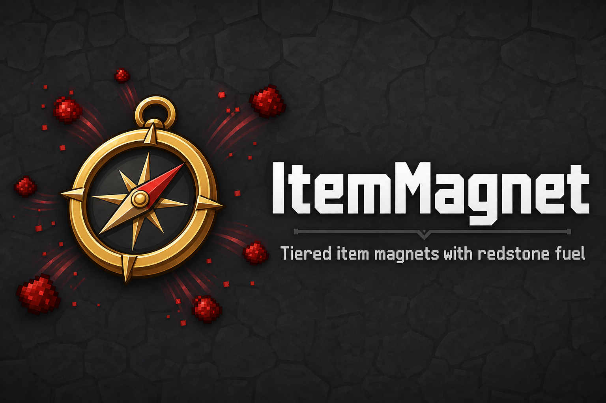

# ItemMagnet

**Tiered item magnets with redstone fuel, claim-aware protection, visible pull physics, and an in-game config editor.**

[](https://papermc.io/)
[](https://adoptium.net/)
[](CHANGELOG.md)
[](LICENSE)



Pull dropped loot toward you with magnets that feel physical — items slide around corners and stop at walls. Charge them with redstone, respect Lands and WorldGuard claims, and tune everything from an admin GUI or `config.yml`.

---

## Why ItemMagnet?

Most magnet plugins teleport items through blocks or ignore land claims. ItemMagnet is built for **survival SMPs** that care about fairness and polish:

- **Visible physics** — step-based pull with line-of-sight; no phasing through walls
- **Claim-aware** — Lands, WorldGuard, Towny, and GriefPrevention hooks
- **Redstone fuel loop** — dust and blocks recharge the magnet; blocks trigger a radius boost
- **Tier progression** — three resonator tiers (fully configurable), recipe unlock gates, per-tier whitelists
- **Admin-friendly** — `/itemmagnet config` GUI, presets, hot reload, LuckPerms-ready permissions

---

## Features

### Gameplay

| Feature | Description |
|---------|-------------|
| **Three tiers** | Fragment, Survey, Anchor — custom materials, names, radius, drain, recipes |
| **Hold modes** | `MAIN_HAND`, `HOTBAR`, or `INVENTORY` (passive magnet in your pack) |
| **XP orbs** | Optional experience orb pulling at the same radius |
| **Fuel system** | Sneak + right-click (either hand) or auto-absorb redstone drops |
| **Power surge** | Redstone blocks add charge + temporary radius boost |
| **Live lore** | Charge, boost, and **current pull radius** on the item tooltip |
| **Sounds** | Per-fuel recharge audio; pull, depleted, and denied cues |

### Server admin

| Feature | Description |
|---------|-------------|
| **Config GUI** | `/itemmagnet config` — edit settings, tiers, fuel, integrations in-game |
| **Rename items** | Change tier display names from the GUI (chat input, `&` colors) |
| **Presets** | `theryn`, `testing`, or roll your own — merge on top of defaults |
| **World filter** | Disable magnets in hub/spawn worlds |
| **Anti-AFK** | Optional movement check; one-time notify (no chat spam) |
| **Unlock gates** | Permission, advancement, CMI stat/rank, or admin command (persisted) |
| **Proximity lore** | Optional coordinate zones — ambient messages when holding a magnet (default off) |

### Integrations (all optional)

- **Lands** — wilderness, owner, member, flag modes
- **WorldGuard** — region whitelist/blacklist, `item-pickup` flag
- **Towny** — town plot protection
- **GriefPrevention** — claim respect
- **PlaceholderAPI** — `%itemmagnet_charge%`, `%itemmagnet_radius%`, tier, boost
- **Developer API** — cancellable pull, fuel absorb, deplete, and XP pull events

---

## Compatibility

| | Requirement |
|---|-------------|
| **Server** | [Paper](https://papermc.io/) **1.21.1 or newer** |
| **Java** | **21 or newer** (run `java -version` on your host) |
| **Tested on** | Paper 1.21.1, 1.21.4, 26.1 |
| **Not supported** | Spigot, CraftBukkit, Folia |

Paper is required — the plugin targets the Paper API and modern event handling (e.g. fuel transfer on 1.21+).

Full matrix: [docs/marketplace/compatibility.md](docs/marketplace/compatibility.md)

---

## Quick start

1. Download `ItemMagnet-1.2.1.jar` from [Releases](https://github.com/RMHavelaar101/item-magent/releases) or [Hangar](https://hangar.papermc.io/Alcerious/ItemMagnets)
2. Place in `plugins/` and restart the server
3. Give yourself a magnet:

   ```
   /itemmagnet give YourName fragment 500
   ```

4. Hold the magnet; put **redstone dust** in your other hand; **sneak + right-click** to fuel
5. Drop items nearby — they pull toward you with visible motion

Optional: `/itemmagnet config` to open the in-game editor.

More detail: [docs/quick-start.md](docs/quick-start.md)

---

## Commands

| Command | Permission | Description |
|---------|------------|-------------|
| `/itemmagnet` | — | Show help (filtered by permission) |
| `/itemmagnet reload` | `itemmagnet.reload` | Hot-reload config and messages |
| `/itemmagnet config` | `itemmagnet.config` | In-game config editor |
| `/itemmagnet give <player> <tier\|all> [charge]` | `itemmagnet.give` | Give a resonator |
| `/itemmagnet giveall <player> [charge]` | `itemmagnet.give` | Give all tiers |
| `/itemmagnet unlock <player> <tier\|all>` | `itemmagnet.unlock` | Unlock a recipe |
| `/itemmagnet unlockall <player>` | `itemmagnet.unlock` | Unlock all recipes |
| `/itemmagnet debug` | `itemmagnet.debug` | Stats for your active magnet |
| `/itemmagnet version` | `itemmagnet.admin` | Version and hook status |

Aliases: `/im`, `/magnet`

Full reference: [docs/commands.md](docs/commands.md)

---

## Permissions (essentials)

| Node | Default | Purpose |
|------|---------|---------|
| `itemmagnet.use` | `true` | Use magnets |
| `itemmagnet.use.<tier>` | `true` | Per-tier use (fragment, survey, anchor) |
| `itemmagnet.wilderness` | `op` | Magnet use in unclaimed Lands/Towny wilderness |
| `itemmagnet.admin` | `op` | Admin commands (reload, give, config, …) |
| `itemmagnet.bypass.lands` | `false` | Skip Lands checks |
| `itemmagnet.bypass.regions` | `false` | Skip WorldGuard region lists |

Full list: [docs/permissions.md](docs/permissions.md)

---

## Configuration

On first run the plugin creates `plugins/ItemMagnet/config.yml` and `messages.yml`.

Key sections:

- **tiers** — materials, display names, lore, radius, recipes, unlocks, whitelists
- **fuel** — redstone dust vs block charge, boost, per-fuel sounds
- **integrations** — Lands, WorldGuard, Towny, GriefPrevention
- **settings** — hold-mode, sounds, fuel radius, XP pull, arm swing
- **presets** — `preset: none | theryn | testing`

Edit via file or `/itemmagnet config`. Most changes hot-reload with `/itemmagnet reload`.

Reference: [docs/configuration.md](docs/configuration.md) · [Config GUI guide](docs/config-gui.md)

---

## Screenshots & media

Marketplace assets to capture before publishing — see [media/README.md](media/README.md):

| Asset | What to show |
|-------|----------------|
| `screenshots/01-tiers-inventory.png` | Three tiers with lore (charge, range, boost) |
| `screenshots/02-items-pulling.gif` | Items sliding around a corner |
| `screenshots/03-fuel-transfer.png` | Sneak + right-click fuel / boost message |
| `screenshots/04-claim-boundary.png` | Pull stopping at a Lands/WG border |
| `screenshots/05-config-gui.png` | `/itemmagnet config` main menu |
| `demo/item-magnet-demo.gif` | 15–30s hero loop for Hangar/Spigot |

Icons: `branding/icon-128.png`, `branding/icon-256.png` · Banner: `branding/banner-1280x640.png`

---

## Documentation

| Topic | Link |
|-------|------|
| Install & requirements | [installation.md](docs/installation.md) |
| Quick start | [quick-start.md](docs/quick-start.md) |
| Configuration | [configuration.md](docs/configuration.md) |
| Config GUI | [config-gui.md](docs/config-gui.md) |
| Commands | [commands.md](docs/commands.md) |
| Permissions | [permissions.md](docs/permissions.md) |
| Developer API | [api.md](docs/api.md) |
| FAQ | [faq.md](docs/faq.md) |
| Publishing checklist | [marketplace/PUBLISHING.md](docs/marketplace/PUBLISHING.md) |

Integration guides: [Lands](docs/integrations/lands.md) · [WorldGuard](docs/integrations/worldguard.md) · [Towny](docs/integrations/towny.md) · [GriefPrevention](docs/integrations/griefprevention.md)

---

## Building from source

```bash
git clone https://github.com/RMHavelaar101/item-magent.git
cd item-magnet
./gradlew build
```

Output: `build/libs/ItemMagnet-1.2.2.jar`

Requires **Java 21+**.

---

## Support

- [Report a bug](https://github.com/RMHavelaar101/item-magent/issues/new?template=bug_report.yml)
- [Request a feature](https://github.com/RMHavelaar101/item-magent/issues/new?template=feature_request.yml)

Include Paper version, Java version, and steps to reproduce.

---

## License

MIT — see [LICENSE](LICENSE).
