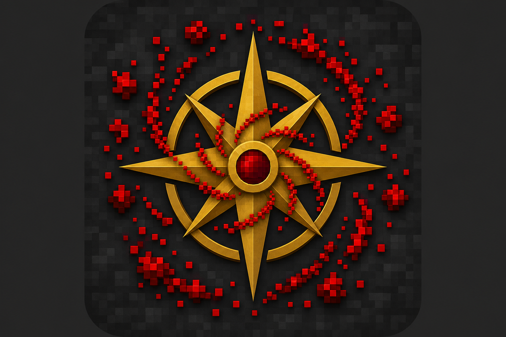

# ItemMagnet

**Tiered item magnets with redstone fuel, claim-aware protection, and visible pull physics.**

## Features

- **Three magnet tiers** — compass, recovery compass, and clock (fully configurable names/materials)
- **Visible item pull** — items step toward you with line-of-sight; no phasing through walls
- **Redstone fuel** — shift+right-click with redstone in off-hand; auto-absorb redstone drops
- **Power surge** — redstone blocks add charge and temporary radius boost
- **Lands support** — wilderness/owner/member/flag modes
- **WorldGuard support** — item-pickup flag + region whitelist/blacklist
- **Recipe unlock gates** — permission, advancement, CMI stat/rank, or admin command
- **Anti-AFK** — optional movement requirement
- **Height modifiers** — underground vs surface radius and drain tuning

## Quick install

1. Download `ItemMagnet-1.0.0.jar` from [Releases](https://github.com/RMHavelaar101/item-magent/releases) or [Hangar](https://hangar.papermc.io/RMHavelaar101/ItemMagnet)
2. Place in your server's `plugins/` folder
3. Restart (requires **Paper 26.1+** and **Java 25**)
4. Edit `plugins/ItemMagnet/config.yml`

## Documentation

Full docs live in [`docs/`](docs/index.md):

- [Installation](docs/installation.md)
- [Quick start](docs/quick-start.md)
- [Configuration](docs/configuration.md)
- [Lands integration](docs/integrations/lands.md)
- [WorldGuard integration](docs/integrations/worldguard.md)
- [CMI unlocks](docs/integrations/cmi-unlocks.md)
- [Permissions](docs/permissions.md)
- [Commands](docs/commands.md)
- [FAQ](docs/faq.md)

## Compatibility

| Requirement | Version |
|-------------|---------|
| Server | Paper **26.1.x** |
| Java | **25** |
| Lands | Optional (7.x) |
| WorldGuard | Optional (7.x) |
| CMI | Optional (unlock gates) |

## Commands

| Command | Permission | Description |
|---------|------------|-------------|
| `/itemmagnet reload` | `itemmagnet.reload` | Reload config |
| `/itemmagnet version` | `itemmagnet.admin` | Version and hook status |
| `/itemmagnet give <player> <tier> [charge]` | `itemmagnet.give` | Give a magnet |
| `/itemmagnet unlock <player> <tier>` | `itemmagnet.unlock` | Unlock recipe |
| `/itemmagnet debug` | `itemmagnet.debug` | Debug held magnet |

## Support

- [Report a bug](https://github.com/RMHavelaar101/item-magent/issues/new?template=bug_report.yml)
- [Request a feature](https://github.com/RMHavelaar101/item-magent/issues/new?template=feature_request.yml)

## License

MIT — see [LICENSE](LICENSE).
